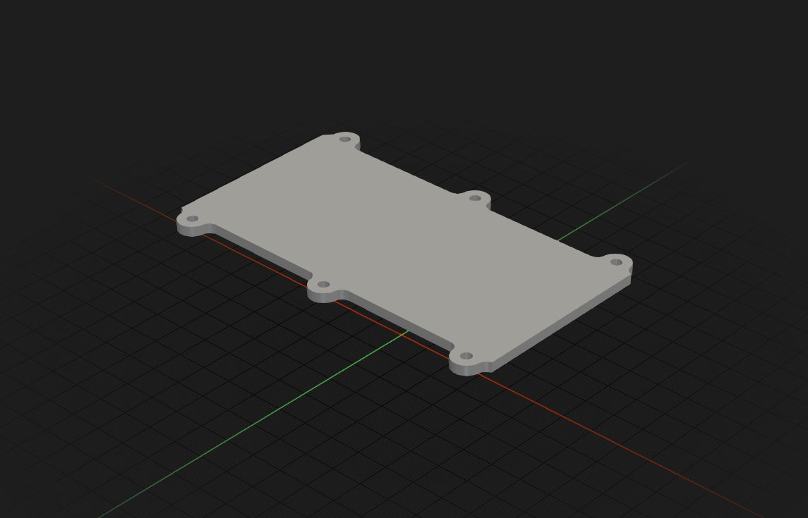
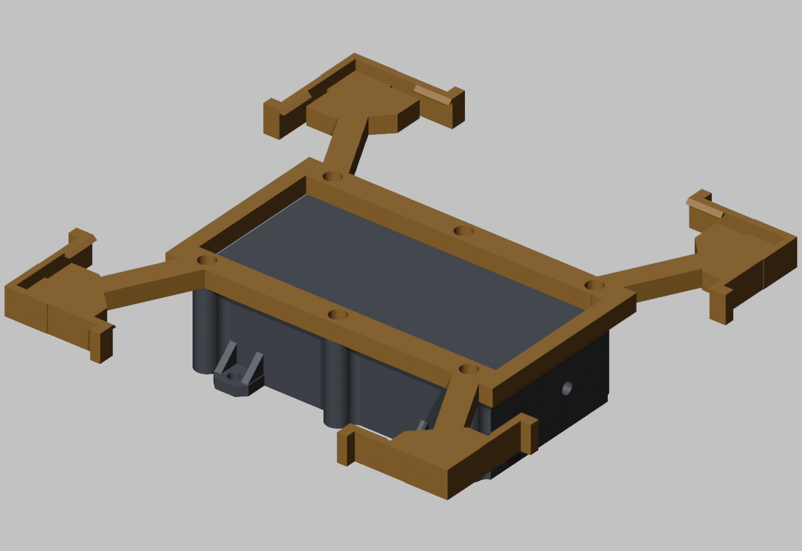
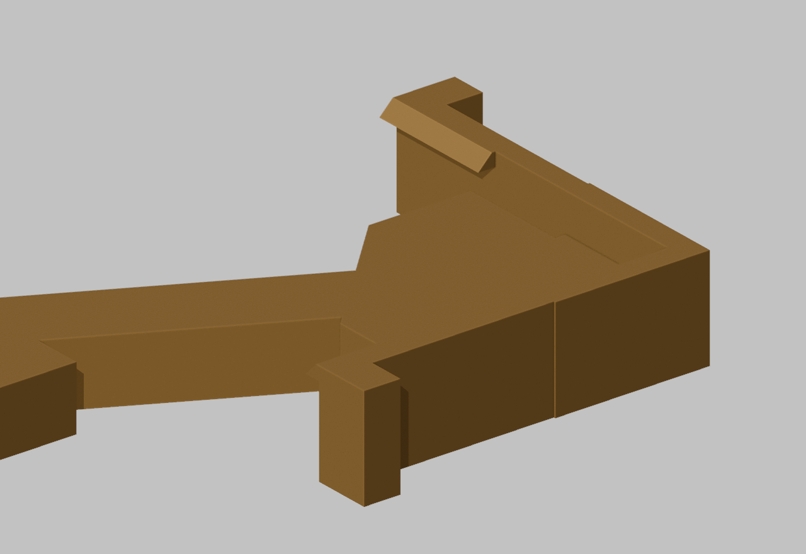
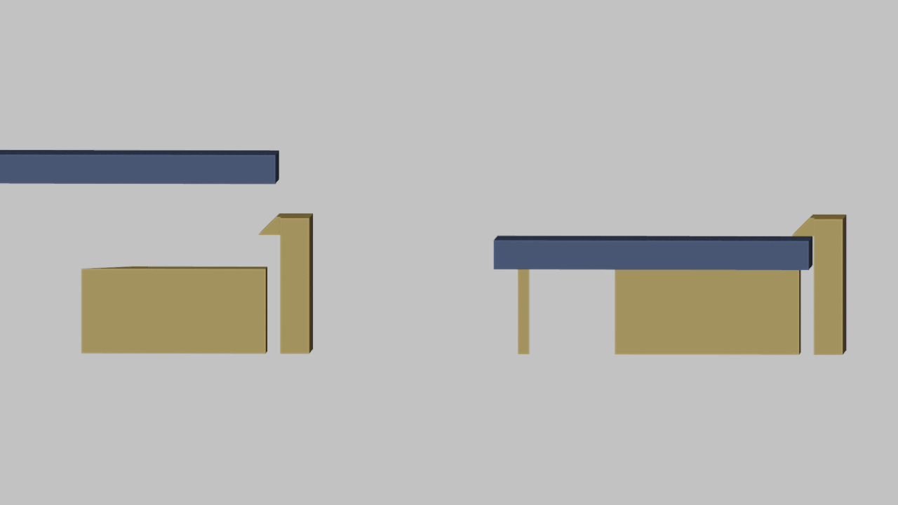

# meshtastic-case

Custodia stampabile in 3D per un nodo Meshtastic, con guarnizione O-ring.

Generata in modo interamente parametrico via script Python/`bpy` per Blender:
nessun file `.blend` da versionare, tutte le quote sono costanti in cima a
[`build_case.py`](build_case.py), unica fonte di verità del progetto.

| Base | Coperchio |
|---|---|
|  |  |

## Contenuto

- Cella **21700** (21 × 70 mm) in sella semicilindrica sul lato −Y, su tre
  bande da 12 mm anziché un blocco pieno
- **Seeed XIAO nRF52840 + Wio-SX1262** (stack 21 × 17.8 × 13 mm), appoggiato
  sul pavimento nella striscia libera lato +Y, fissato a biadesivo (nessun
  supporto stampato, nessuna asola USB)
- Connettore **N bulkhead** (filetto 5/8"-24) sulla parete −X, con scasso
  interno per dado e chiave
- **Guarnizione O-ring**: corda di silicone Ø3 mm in cava continua sul bordo
  della base (~312 mm di sviluppo)
- Chiusura con **6 viti M3** su inserti a caldo, in lug esterni fuori dalla
  linea di tenuta
- **4 alette M4** complanari al pavimento per il fissaggio al dorso del
  pannello solare (o a palo)
- Passacavo Ø5 nella parete +X (opposta all'antenna), da sigillare a silicone

Ingombro esterno: **117.8 × 58.8 × 32.1 mm**, **80.8 mm** in Y contando le
alette.

Il dettaglio di ogni scelta progettuale (perché le pareti sono a 6.4 mm,
perché la sella è divisa in tre bande, i vincoli sullo scasso del
connettore, ecc.) è documentato in [`CLAUDE.md`](CLAUDE.md).

## Montatura del pannello solare

Accessorio opzionale ([`build_mount.py`](build_mount.py)) per appendere un
pannello da 170 × 170 mm **senza forarlo e senza toccare la custodia**: **un
pezzo solo** che si infila fra le teste delle sei viti M3 e il coperchio, e
prende il pannello per i quattro angoli con otto linguette a scatto.



- **Un solo pezzo, nessuna vite in più**: le sei M3 del coperchio diventano
  M3×12 e basta (le teste stanno annegate nello svaso, il pannello ci appoggia
  sopra)
- **Anello chiuso su tutte e sei le viti**: tre viti in fila, da sole, non
  bloccherebbero la rotazione attorno alla loro linea
- Del coperchio tocca **solo i lug e la striscia sopra le pareti**, mai la
  campata centrale: il coperchio non viene inarcato e la tenuta non si apre
- **Otto linguette a scatto** (due per angolo), con aletta per aprirle a mano
- Tutto estruso in verticale dal piano di stampa: **nessun supporto**, nessun
  piedino, appoggio pieno sul piatto
- Il pannello è di misura **fissa**: si cambia `PANEL_W`/`PANEL_H` e si
  ristampa

| Dettaglio di una testa d'angolo |
|---|
|  |

Come si aggancia, in sezione attraverso una linguetta: il pannello scende, la
rampa a 45° apre la linguetta verso l'esterno di 1.5 mm, e appena il dorso
appoggia sul piano il dente scatta sopra la faccia anteriore.



## File

- `build_case.py` — sorgente parametrico, unica fonte di verità
- `case_base.stl`, `case_lid.stl` — output STL pronti per lo slicer
- `verify_case.py` — rigenera e verifica la geometria via ray-casting su
  punti campione (cava O-ring, spalle, cavità, fori)
- `build_mount.py` — montatura del pannello solare
- `panel_mount.stl` ×1 — output della montatura
- `verify_mount.py` — verifica della montatura (topologia + ~560 punti)
- `render_mount.py`, `render_corner_section.py` — render di controllo

## Rigenerare gli STL

Richiede [Blender](https://www.blender.org/) (testato con 4.x/5.x):

```sh
blender --background --factory-startup --python build_case.py
blender --background --factory-startup --python build_mount.py
```

Lo script cancella la scena, la ricostruisce da zero ed esporta gli STL
nella cartella corrente.

## Stampa

- Base: apertura verso l'alto, nessun supporto necessario
- Coperchio: piatto, nessun supporto
- Guarnizione: corda di silicone Ø3 mm, giuntata a colla nella cava
- Chiusura: 6 inserti filettati M3 a caldo + viti M3×10 a testa bombata
- Fissaggio: 4 viti/bulloni M4 nelle alette
- Montatura: un pezzo solo, appoggiato sul piatto così com'è; niente supporti,
  ~38 g in PETG. Con la montatura le sei viti diventano **M3×12** (impegno 5.3
  mm nell'inserto) e non serve nient'altro

## Licenza

[MIT](LICENSE)
