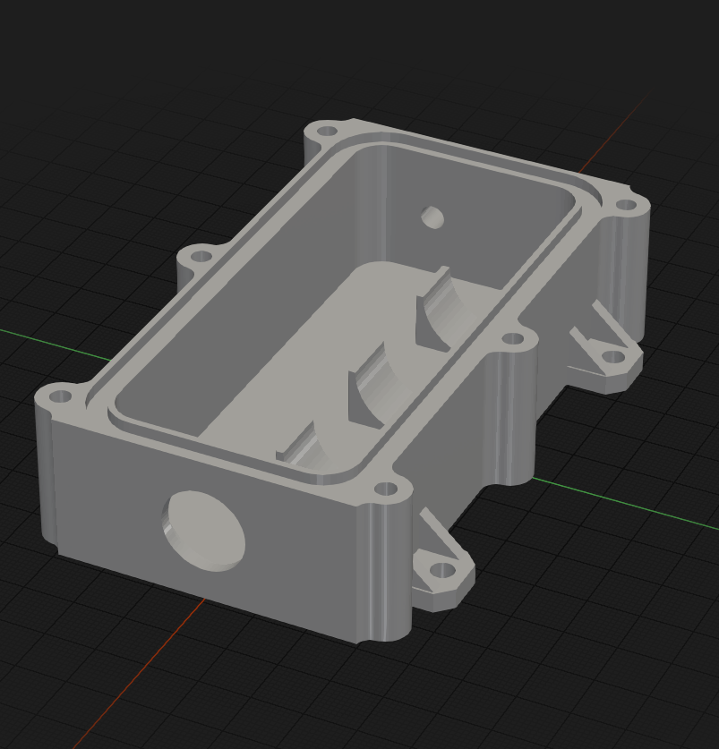
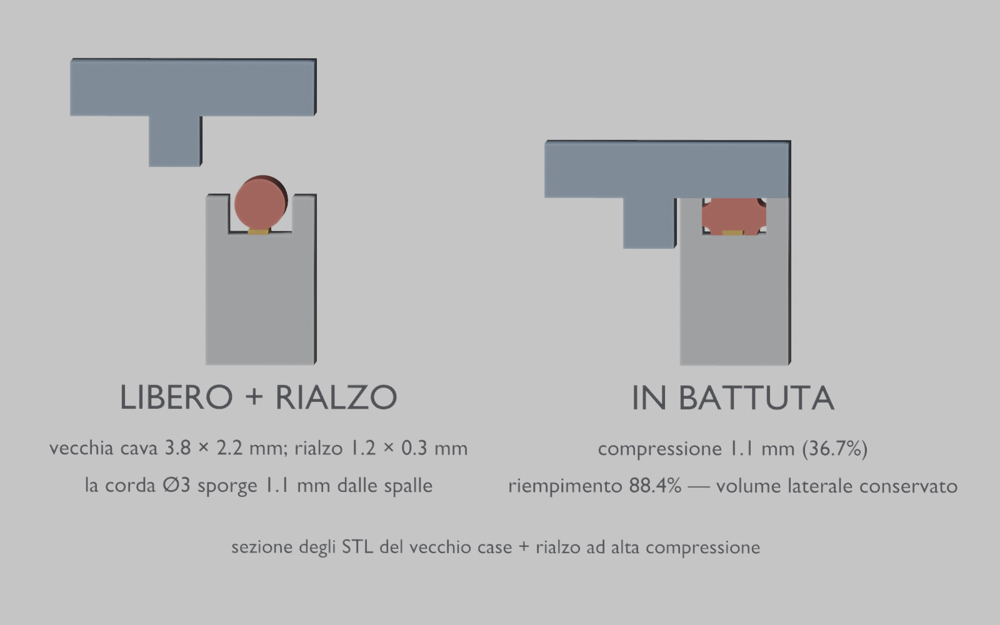
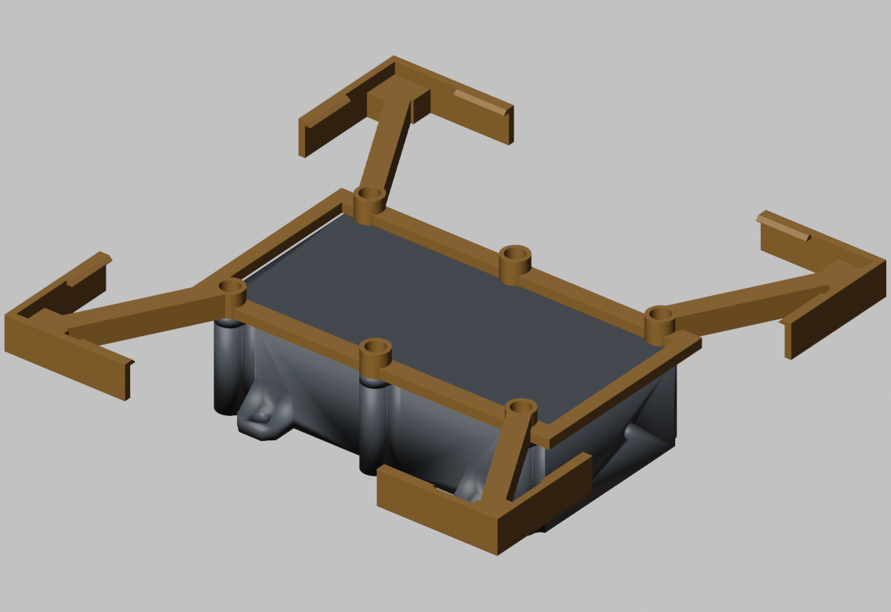
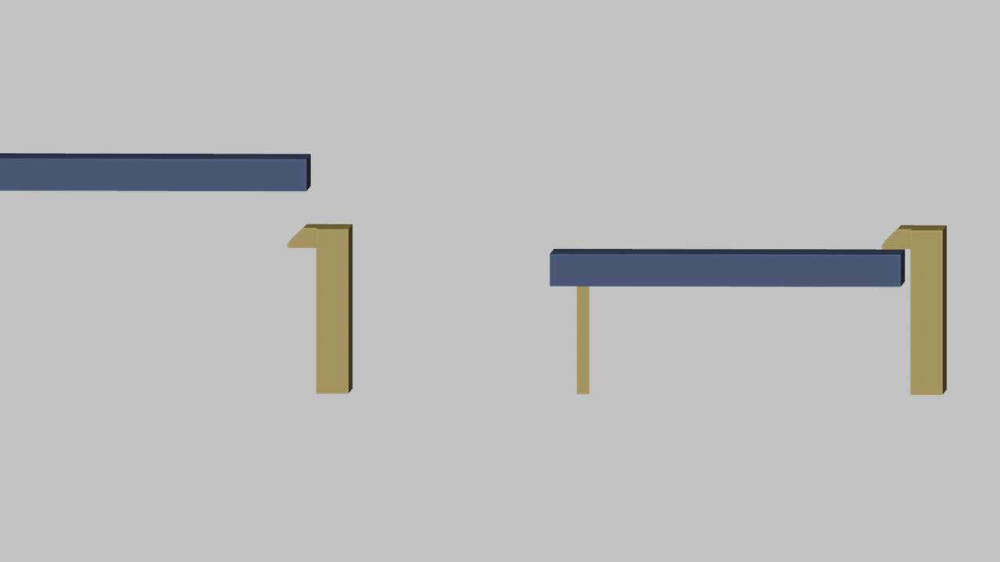

# meshtastic-case

Custodia stampabile in 3D per un nodo Meshtastic, con guarnizione O-ring.

Generata in modo interamente parametrico via script Python/`bpy` per Blender:
nessun file `.blend` da versionare, tutte le quote sono costanti in cima a
[`scripts/build_case.py`](scripts/build_case.py), unica fonte di verità del
progetto.

| Base | Coperchio |
|---|---|
|  |  |

## Contenuto

- Cella **21700** (21 × 70 mm) in sella semicilindrica sul lato −Y, su tre
  bande da 12 mm anziché un blocco pieno
- **Seeed XIAO nRF52840 + Wio-SX1262** (stack 21 × 17.8 × 13 mm), appoggiato
  sul pavimento nella striscia libera lato +Y, fissato a biadesivo (nessun
  supporto stampato, nessuna asola USB)
- Connettore **N bulkhead** (filetto 5/8"-24) sulla parete −X, con scasso
  interno per dado e chiave
- **Guarnizione O-ring**: corda di silicone Ø3 mm in cava continua sul bordo
  della base (~312 mm di sviluppo)
- Chiusura con **6 viti M3** su inserti a caldo, in lug esterni fuori dalla
  linea di tenuta
- **4 alette M4** complanari al pavimento per il fissaggio al dorso del
  pannello solare (o a palo)
- Passacavo Ø5 nella parete +X (opposta all'antenna), da sigillare a silicone

Ingombro esterno: **117.8 × 58.8 × 32.1 mm**, **80.8 mm** in Y contando le
alette.

Il dettaglio di ogni scelta progettuale (perché le pareti sono a 6.4 mm,
perché la sella è divisa in tre bande, i vincoli sullo scasso del
connettore, ecc.) è documentato in [`CLAUDE.md`](CLAUDE.md).

### Aggiornamento della vecchia cava O-ring

Per una base già stampata con la cava 3,8 × 2,2 mm, stampare una copia di
[`oring_groove_shim.stl`](models/oring_groove_shim.stl) e adagiarla centrata sul
fondo della cava prima della corda Ø3. Il rialzo è alto 0,20 mm e largo 1,80:
porta lo schiacciamento dal 27% al 33%, lasciando ai lati il volume necessario
alla deformazione del silicone. Non serve ristampare la base.

Stampare piatto, senza supporti, con primo layer da **0,20 mm**, scala 100% e
senza compensazioni Z. Se serve tenerlo fermo durante il montaggio, usare solo
pochi punti sottili di adesivo; grumi o sovrapposizioni alterano la tenuta.

Se serve più pressione, usare invece
[`oring_groove_shim_high_compression.stl`](models/oring_groove_shim_high_compression.stl):
è alto 0,30 mm e largo 1,20 mm, porta la compressione a circa il 37% e conserva
lo stesso volume libero. Stampare con primo layer da **0,30 mm** e non
sovrapporlo allo spessore standard.



## Montatura del pannello solare

Accessorio opzionale ([`build_mount.py`](scripts/build_mount.py)) per appendere un
pannello da 170 × 170 mm **senza forarlo e senza toccare la custodia**: **un
pezzo solo** che si infila fra le teste delle sei viti M3 e il coperchio, e
prende il pannello per i quattro angoli con otto linguette a scatto.



- **Un solo pezzo, nessuna vite in più**: le sei M3 del coperchio diventano
  M3×12 e basta (le teste stanno annegate nello svaso, 2.3 mm sotto il
  pannello)
- **Lastra da 3.5 mm**, che sale a 8 solo dove serve: i sei bossi delle viti,
  i quattro bracci e le teste d'angolo
- **Anello chiuso su tutte e sei le viti**: tre viti in fila, da sole, non
  bloccherebbero la rotazione attorno alla loro linea
- Del coperchio tocca **solo i lug e la striscia sopra le pareti**, mai la
  campata centrale: il coperchio non viene inarcato e la tenuta non si apre
- **Otto linguette a scatto** (due per angolo), premibili dal fianco per sganciare
- Testa d'angolo a **L**: due lamelle (fermo laterale e linguetta nello stesso
  prisma) e due rami di piano d'appoggio che ne fissano la radice — niente
  blocco pieno d'angolo, niente aria di manovra da rispettare
- Tutto estruso in verticale dal piano di stampa: **nessun supporto**, nessun
  piedino, appoggio pieno sul piatto
- Il pannello è di misura **fissa**: si cambia `PANEL_W`/`PANEL_H` e si
  ristampa
- ~23 g in PETG, ingombro 176.2 × 176.2 × 12.2 mm

| Dettaglio di una testa d'angolo |
|---|
|  |

Come si aggancia, in sezione attraverso una linguetta: il pannello scende, la
rampa a 45° apre la linguetta verso l'esterno di 1.5 mm, e appena il dorso
appoggia sul piano il dente scatta sopra la faccia anteriore.



## Struttura del progetto

- `scripts/` — generatori parametrici, verifiche geometriche e script di render
- `models/` — tutti gli STL pronti per lo slicer
- `renders/` — immagini e sezioni tecniche generate
- `tools/` — utility di sviluppo non necessarie per stampare il progetto

Gli script risolvono i percorsi a partire dalla root del progetto: possono
essere lanciati da qualunque directory e scrivono sempre in `models/` o
`renders/`.

## Rigenerare gli STL

Richiede [Blender](https://www.blender.org/) (testato con 4.x/5.x):

```sh
blender --background --factory-startup --python scripts/build_case.py
blender --background --factory-startup --python scripts/build_mount.py
blender --background --factory-startup --python scripts/build_oring_shim.py
```

Gli script cancellano la scena, la ricostruiscono da zero ed esportano gli STL
in `models/`.

## Stampa

- Base: apertura verso l'alto, nessun supporto necessario
- Coperchio: piatto, nessun supporto
- Rialzo O-ring: piatto, un solo layer da 0,20 mm, nessun supporto
- Rialzo O-ring ad alta compressione: piatto, un solo layer da 0,30 mm
- Guarnizione: corda di silicone Ø3 mm, giuntata a colla nella cava
- Chiusura: 6 inserti filettati M3 a caldo + viti M3×10 a testa bombata
- Fissaggio: 4 viti/bulloni M4 nelle alette
- Montatura: un pezzo solo, appoggiato sul piatto così com'è; niente supporti,
  ~23 g in PETG. Con la montatura le sei viti diventano **M3×12** (impegno 5.3
  mm nell'inserto) e non serve nient'altro

## Licenza

[MIT](LICENSE)
